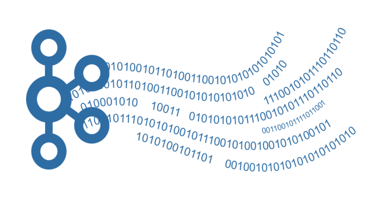

# Java Steams 

## Usefull Stream Methods

Example on a basic Array:

```java
private int[] numbers = new int[]{1,4,5,3,2};
private String[] names = new String[]{"Jay","Paul"};
```

### 1. Sorted()

```java
numbers = Arrays.stream(numbers).sorted().toArray();
```

- if every object of the stream implements the Comparably interface, you can just call `sorted()` and it will sort the stream according to the `compareTo` function.

- if this is not the case, or you simply want another sorting criteria, the static fuction `Comparator.comparing` can be used to specify how to sort.

 ```java
 names = Arrays.stream(names)
 .sorted(Comparator.comparing(s -> s.charAt(0))).toArray(String[]::new);
 ```

- here the Array was changed to a `String Array`, and sorted according to the first char of each String;

### 2. takeWhile() / dropWhile()

<br>

- the `takeWhile()` operation takes a `predicate` as an parameter, and breaks the stream, at the first element that does not satisfy the condition.

```java
Arrays.stream(numbers).takeWhile(number -> number < 10);
```

- the calculation of the stream ends with the first `number` thats less than 10 (excluded)

---
<br>

- the `dropWhile()` operation is basically the oposite of `takeWhile`, it takes a `predicate` as an parameter, and removes elements from the stream until the first element does not satisfy the condition.

```java
int[] numbers = new int[] {3,4,5,11,6,20};

Arrays.stream(numbers).dropWhile(number -> number < 10);
```

- in this example, only the elements `6` and `20` will remain for further calculations.

### Honorable Mentions

- `AnyMatch(predicate)`: returs true if one element satisfies the predicate

- `AllMatch(predicate)`: returns true if all elements satisfy the predicate

- `NoneMatch(predicate)`: returns true if no element satisfies the predicate

- `count()`: returns the number of elements in the stream

- `distinct()`: returns a stream where each distinct element only occures once. Uses the `HashCode` to distinct between objects

- **...**

## Mapping Functions

### Map()

- the function mapps the current stream element into a new type

```java
 Arrays.stream(names).map(string -> string.charAt(0));
 ```

- in this example all strings of the stream are mapped to their first char -> a char stream is returned.

### Stream to String:
```java
public static String prettyDirections(Stream<OneWay> oneWays) {  
    return oneWays.map(OneWay::prettyPrint).collect(Collectors.joining("\n"));  
}
// Collectors.joining(...) will join all elements of stream to a string seperated by specifyed delimiter
```

### Stream to Map< K, List< V > > (very useful)
train ex from pgdp
```java
Map<String, List<TrainConnection>> typeToConnections = connections
                .collect(Collectors.groupingBy(TrainConnection::type));
```

### Stream to Map< K, < Anything > (even more useful)
Variation of function above where you pass a second argument (Collector) in .groupingBy() to get e.g. an average.

``` java
connections.flatMap(trainConnection -> trainConnection.stops().stream()).collect(Collectors.groupingBy(trainStop -> trainStop.actual().getHour(), Collectors.averagingDouble(TrainStop::getDelay)));
```

this would be the second Collector in this example
```java 
Collectors.averagingDouble(TrainStop::getDelay)
```
### Map to Primitive

- per default, the elements in a stream are always objects, if you want to apply a functions specific to primitve types, a conversion is required.

```java
Stream tmp = Arrays.stream(names).mapToInt(string -> string.length());

return tmp.sum();
```

- this converts the stream into a stream of primitive types and sums each value.

- this also works for `double` and `long`

### Flatmap()

the `flatmMap` operation takes a steam of streams as input, and converts it into a single output stream.


